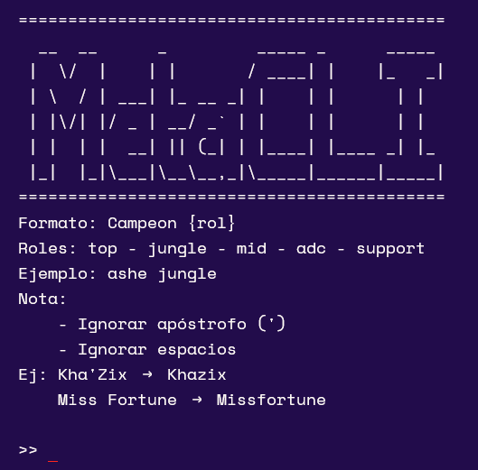

# MetaCLI


MetaCLI es un sistema de informacion desde la consola que despliega informacion sobre un campeón haciendo scrapping en la pagina www.metasrc.com.
### Librerias utilizadas.
- Beautifulsoup4
- Pandas
- Requests
## Caracteristicas implementadas.
- Opcion de solicitar el rol default de un campeón.
- Mostrar en pantalla objeto iniciales del campeón.
- Mostrar en pantalla objetos con el mejor winrate del parche.
- Mostrar en pantalla el orden de habilidades con mejor winrate del parche.

## Uso
```bash
python3 main.py
```
Como input se espera el siguiente formato:
```
Nombre_de_Campeón {Rol}
```
###### En donde {Rol} es un argumento opcional
---
Para salir
```
exit
```
## Ejemplo


